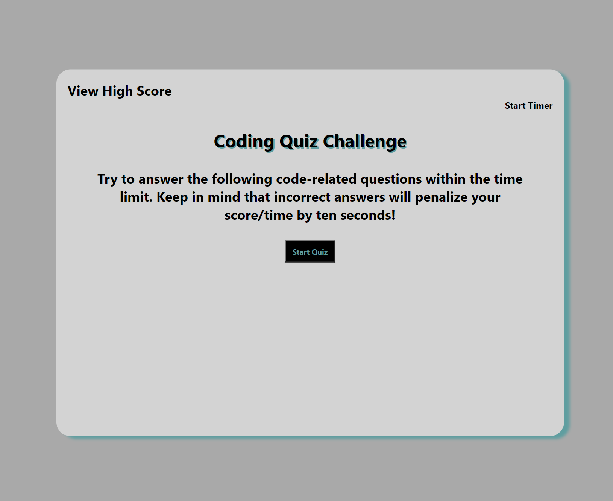

# Sparkling-Code-Quiz
## A Code Quiz created by Tracee Brown to make a quiz out of JavaScript and learn a few things from the questions and answers to go with it and a timer that starts at the push of the start button and deducts time when select the wrong  answer. This was one of the more difficult challenges to make and i ran out of time, but i hope with more experience i can come back to this and finish it. 
*Updated professional portfolio with one screenshot image.
*Created an HTML.index, style.CSS stylesheet, Script.js and this README.md
*Added ways to contact me. 
_https://github.com/tra8brown/Sparkling-Code-Quiz/tree/develop_
_https://tra8brown.github.io/Sparkling-Code-Quiz/_
